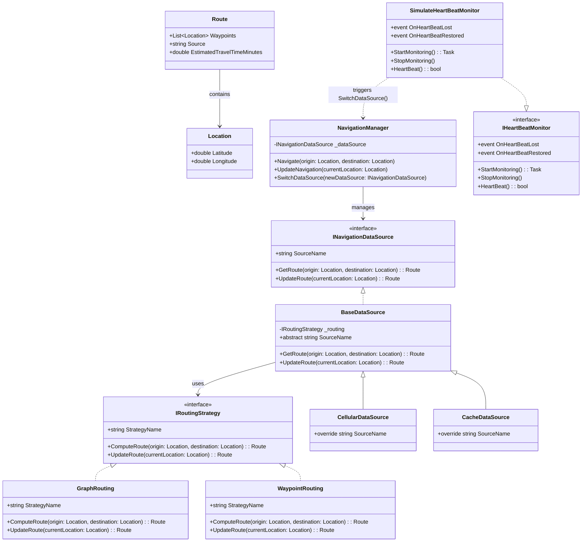
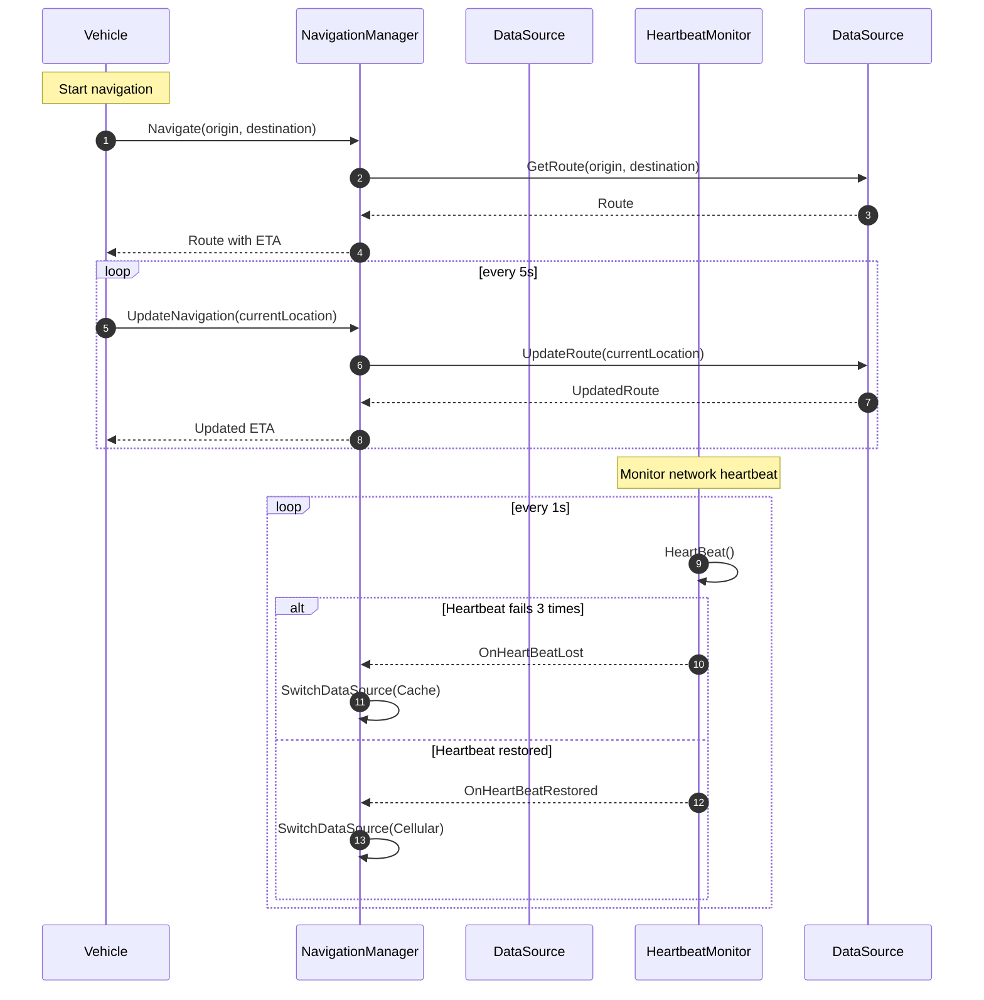

# Heartbeat Tactic – Navigation System with Fault-Tolerant Data Source Switching

## Overview
This project simulates a navigation system for a self-driving vehicle that dynamically switches between live cellular and cached navigation data sources. It uses a heartbeat monitoring system to ensure fault tolerance and high availability.

The heartbeat is considered successful when communication with the cellular tower or a heartbeat server is maintained. A failed heartbeat occurs when communication is lost due to reasons such as network outage, low battery disabling features, data plan exhaustion, or other disruptions. In this simulation, the heartbeat is randomized using a built-in random function with a 70% success rate.

---

## Architecture Design

### Core Components

- **Models**
  - `Location`: Represents a geographical coordinate with latitude and longitude.
  - `Route`: Contains a list of waypoints and the estimated travel time.

- **Routing Strategies**
  - Abstracts the computation of a route between two locations.
  - `WaypointRouting`: A simple flatmap waypoint-to-waypoint routing approach.
  - `GraphRouting`: A graph-based routing approach (more realistic, supports traffic data, weights, road events, etc.).

- **Navigation Data Sources**
  - Abstracts how navigation data is retrieved.
  - `CellularDataSource`: Fetches live data using a routing strategy.
  - `CacheDataSource`: Uses preloaded data with a routing strategy.
  - Both inherit from `BaseDataSource` to share common logic and reduce duplication.

- **Navigation Manager**
  - Manages the currently active data source (cellular or cache).
  - Provides methods to start navigation and update the route.
  - Supports dynamic switching of the data source when needed.

- **Heartbeat Monitor**
  - Monitors for connectivity by simulating heartbeat signals.
  - Triggers `OnHeartBeatLost` and `OnHeartBeatRestored` events.
  - The navigation manager listens to these events and switches data sources automatically.
  - The `IHeartBeatMonitor` interface allows future extensions (e.g., real network monitoring), while `SimulateHeartBeatMonitor` provides the mock implementation used in this simulation.


  ### Class Diagram

---

## High Availability and Fault Tolerance – Heartbeat Tactic

- The system uses a heartbeat monitor to simulate communication with the cellular network.
- A heartbeat failure is simulated by three consecutive missed checks.
- When a failure is detected:
  - `OnHeartBeatLost` is triggered.
  - The system switches from `CellularDataSource` to `CacheDataSource`.
- When a successful heartbeat is restored:
  - `OnHeartBeatRestored` is triggered.
  - The system switches back to `CellularDataSource`.
- This ensures continued availability of navigation functionality even during connectivity issues.

---

## Simulation (Program.cs)

- The vehicle navigates from **Rochester, NY** to **New York City**.
- The position is updated every 5 seconds, simulating movement along the route.
- A simulated heartbeat runs in parallel, randomly failing or succeeding.
- The navigation manager switches between live and cached data sources based on the heartbeat.
- Console output logs route updates and which data source is being used.
- Note: Estimated travel time is fixed for the purpose of demonstration.

### Sequence Diagram


---

## How to Run
1. Ensure that you have the [.NET core](https://dotnet.microsoft.com/en-us/download). .NET is a cross-platform framework that allows you to write applications in C#.
2. Clone the project
3. cd into the project folder
4. Build and run the project using the following command:
```bash
dotnet run
```

